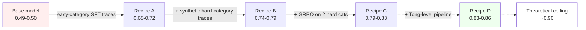
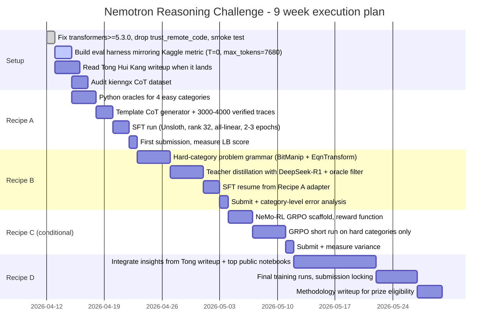

# Winning the NVIDIA Nemotron Model Reasoning Challenge — A Ranked Strategy Brief

**Date:** 2026-04-12
**Author:** Feynman (inline research, no subagent fan-out)
**Competition:** [NVIDIA Nemotron Model Reasoning Challenge](https://www.kaggle.com/competitions/nvidia-nemotron-model-reasoning-challenge) — closes 2026-06-15
**Target model:** `nvidia/NVIDIA-Nemotron-3-Nano-30B-A3B-BF16` (hybrid Mamba-2 + Transformer MoE, 30 B total / 3.5 B active) [^S1]
**Constraint:** rank ≤ 32 LoRA adapter, vLLM inference, `temperature=0.0`, `max_tokens=7680`, `\boxed{}` grading, `rel_tol=1e-2`
**Companion files:** `outputs/nemotron-reasoning-lora-research-{model,kaggle,data,papers}.md` + `outputs/.plans/nemotron-reasoning-lora.md`

---

## Executive Summary

This is **not a "reasoning" competition in the usual sense**, and recognizing that is 60 % of the work. NVIDIA's "novel reasoning benchmark" is actually a set of six **templated, algorithmically-generated task categories** with deterministic answers: Gravitational Constant, Number Base Conversion, Unit Conversion, Text Encryption, Bit Manipulation, and Equation Transformation. [^S2] [^S3] Four of the six categories can be driven to **100 % accuracy** with clean chain-of-thought (CoT) traces; a fifth (Text Encryption) reaches ~96 %; the remaining two — **Bit Manipulation** (especially multi-op boolean composition) and **Equation Transformation** (especially its *symbolic* sub-case) — are where the leaderboard gap lives. One competitor at 81 % local val reports this exact profile. [^S2]

The practical consequence: **every point of leaderboard score above ~0.72 comes from quality of per-category CoT traces, not from novel SFT architectures or RL theory**. The NVIDIA baseline demo scores **0.49–0.50**; public SFT notebooks top out at **0.70**; the private leaderboard has twelve teams at **≥0.79** (top-10 % threshold) and a #1 submission at **0.85** held by Tong Hui Kang, who has committed to publishing their full method by Sunday April 12 UTC. [^S4] [^S5] [^S6] The accuracy ceiling estimated by competitors on local ensembles is **~0.90**, limited by what appears to be ~10 % faulty test samples. [^S6]

Given the user's position (5 submissions/day, ~9 weeks remaining, access to RTX PRO 6000 class hardware, first submission), the highest-expected-value plan is:

1. **Before any training: read Tong Hui Kang's forthcoming writeup** (expected within hours of this brief) and the `kienngx/nemotron-30b-competition-trainingdata-cot-labels` Kaggle dataset. [^S5] [^S7]
2. **Fix the tooling traps first** — install `transformers>=5.3.0`, drop `trust_remote_code=True`, set `gradient_checkpointing=False`, use `target_modules="all-linear"`, enable Unsloth fused cross-entropy. These give a 19× GRPO speedup and are non-negotiable. [^S8] [^S9] [^S10]
3. **Recipe A — SFT-only on verified per-category traces (rank 32)** is the mandatory floor. With Python-oracle-verified CoT over the four easy categories, expected score ≈ **0.65–0.72** after 1–2 days of wall-clock.
4. **Recipe B — add synthetic Equation-Transformation problems with a strong open teacher** (DeepSeek-R1 via API, ~$20–$50) and re-SFT. Expected ≈ **0.74–0.79** (top-10 %) after a further day.
5. **Recipe C — SFT → short GRPO on the 2 hard categories with a Python oracle as reward**, enabled by the transformers 5.3.0 cache fix. Expected ≈ **0.79–0.83** when it works, but fragile and rewards engineering discipline.
6. **Recipe D — full top-team-style pipeline**: Tong's published methods + aggressive synthetic generation + category-aware curriculum + RL. Expected ≈ **0.83–0.86**. Gated entirely on reading Tong's writeup.

Confidence on the qualitative ordering is **high**; on specific numeric bands, **medium** — they are calibrated against public notebooks and leaderboard clusters as of 2026-04-12, not against controlled ablations run by this research.

---

## 1. Situation Assessment

### 1.1 Leaderboard snapshot (2026-04-12, 50/50 public/private split)

| Cohort | Score | Anchor |
|---|---|---|
| NVIDIA reference demo (no adapter) | **0.49–0.50** | baseline floor [^S4] |
| Early LoRA SFT public notebooks | 0.53–0.66 | [^S5] |
| Top public SFT / SFT+GRPO notebooks | **0.70** | [^S5] |
| Silver-medal band (14th–46th) | 0.76–0.79 | [^S4] |
| **Top-10 % threshold (gold-medal boundary)** | **~0.79** | [^S4] |
| Top 5 teams | 0.80–0.83 | [^S4] |
| **#1 Tong Hui Kang (Open Progress Prize winner)** | **0.85** | [^S4] [^S6] |
| Consensus local-ensemble ceiling | ~0.90 | [^S6] |

**Two known sources of variance:** (a) eval is non-deterministic (Ryan Holbrook, competition host, acknowledged; competitors see ±0.01–0.04 drift on identical adapters) [^S8]; (b) the private 50 % is drawn from a different sample of problems, possibly with category-mix drift.

*Figure 1. Expected score trajectory vs. recipe. Bands are soft estimates calibrated against public notebooks and leaderboard clusters; see §4 for sources and §7 for open questions.*

### 1.2 The benchmark is task-structured, not open-ended

Competitor reverse-engineering [^S2] [^S3] [^S11] establishes that the 9,500-problem training set (and, by assumption, the test set) is organized into six clean categories with deterministic answers:

| Category | Difficulty (current SFT ceiling) | What's hard |
|---|---|---|
| Gravitational Constant | 100 % | Already solved |
| Number Base Conversion | 100 % | Already solved |
| Unit Conversion | 100 % | Already solved |
| Text Encryption | ~96 % | Mostly solved; occasional edge cases |
| **Bit Manipulation** | 9–46 % | Multi-step boolean composition (xnor, or_not, and_not). The 3.5 B-active model has genuine capability limits on boolean algebra. [^S2] |
| **Equation Transformation** | Numeric ≈ 52 %, Symbolic ≈ 4 % | Meta-puzzle: infer bijection {symbols → digits} and {symbols → operators} from 3–5 few-shot examples, apply to query. Combinatorial and under-determined. [^S3] [^S11] |

**Known failure modes of the provided training data** (from Ashutosh Kumar's audit, [^S9]):
- **Bit-Manipulation:** 764 of 1,513 examples (50.5 %) have a mismatch between the derived "Result" line and the `\boxed{}` answer. Training naively on these teaches wrong reasoning.
- **Equation-Transformation:** 1,555 of 3,157 examples (49 %) have input/output length mismatches that break the naive char-map approach; another 44 % contain unknown symbols not covered by the few-shot examples.

These data bugs mean **do not train directly on the supplied traces**. Generate fresh, oracle-verified traces instead.

### 1.3 The eval harness is hostile in two specific ways

- **`temperature = 0.0`** even though NVIDIA recommends `T=1.0` for Nemotron-3 reasoning [^S1]. Deterministic decoding means no self-consistency / majority voting is possible, so *single-shot* correctness is everything.
- **`\boxed{}` regex** in the metric is `r'\\boxed\{([^}]*)(?:\}|$)'` — it stops at the first `}`. If your LoRA-tuned model ever produces `\boxed{f(x)} = ...`, the match is `f(x`. [^S12] Make sure training traces end cleanly with `\boxed{final_answer}` where the answer is a plain token (number, short string, or bitstring).
- **Numerical tolerance** is `rel_tol=1e-2, abs_tol=1e-5` — about 1 part in 100. Always safe to round to 3 significant figures. [^S10]
- **Binary strings** are compared **strictly**, case-insensitive, after `.strip()`. A trailing newline or `0b` prefix is fatal. [^S10]

### 1.4 Technical landmines you need to know *before* you start

| Landmine | Fix | Source |
|---|---|---|
| `modeling_nemotron_h.py` passes `past_key_values` but `forward()` expects `cache_params` → KV cache silently dropped, generation collapses to **~2 tok/s** (19× slowdown) | `pip install "transformers>=5.3.0"` and **drop `trust_remote_code=True`**. Also set `gradient_checkpointing=False` (NemotronHForCausalLM doesn't declare support). | [^S8] (Parmar) + CPMP host confirmation |
| `VLLM_USE_FLASHINFER_MOE_FP8` is **not compatible with LoRA** | Use **BF16 base** (`nvidia/NVIDIA-Nemotron-3-Nano-30B-A3B-BF16`), not FP8, for both training and inference. | vLLM PR #30802 [^S13] |
| Router-gate fine-tuning is unstable on MoE + LoRA | **Exclude the router gate** from LoRA targets. Unsloth does this by default. | Unsloth guide [^S1] |
| `\boxed{}` regex stops at first `}` | Never place `}` inside the answer payload. | metric source [^S10] |
| vLLM version must match harness | Use **vLLM 0.12.0** locally to minimize train/eval drift. 0.11.2 also supports the model but may differ at edges. | vLLM recipes [^S13] |
| VRAM: at rank 32 with `all-linear`, training is **886.7 M trainable params** (~97 % in routed MoE expert projections); μ=1 fits 96 GB at **83.4 GB**; μ=4 at **91.3 GB**; μ=16 **does not fit**. Unsloth's **fused cross-entropy** is mandatory for headroom. | Keep `micro_batch_size ≤ 4`, use Unsloth or equivalent fused-CE. | Tong Hui Kang's memo [^S14] |

---

## 2. Recipe Shortlist (Ranked by Expected Gain per Engineering Hour)

Each recipe below assumes the landmines in §1.4 are already fixed. Costs are for a single RTX PRO 6000 96 GB rented at GCP spot ~$0.90/h (Tito_42, [^S5]) or Modal ~$3.03/h (Tong, [^S15]); API spend assumes DeepSeek-R1 at public rates.

### Recipe A — Oracle-verified per-category SFT (mandatory floor)

- **Goal:** Lock down the four easy categories at ≥95 % accuracy each.
- **Data:**
  1. For each of Gravitational Constant, Number Base Conversion, Unit Conversion, Text Encryption: write a ~50-line Python solver per category that takes the problem text and produces the correct boxed answer (all deterministic by category definition).
  2. Generate a CoT trace using a **template** (not an LLM) that walks through solver steps in natural language ending with `\boxed{...}`.
  3. Produce 500–1,000 clean traces per category = ~3,000–4,000 examples total. Keep traces ≤ 2,000 tokens each so the 7,680-token eval budget has plenty of slack.
  4. **Decontamination check:** re-run the Python oracle against the boxed answer in every trace and discard mismatches.
- **Training:** Unsloth Nemotron-3 Nano recipe [^S1], rank 32, `target_modules="all-linear"`, skip router gate, LR 2e-5, 2–3 epochs, microbatch 1, gradient accumulation 16, seq len 4096.
- **Compute:** ~8–16 h on RTX PRO 6000 = **$7–50** (spot GCP to Modal range).
- **API spend:** $0.
- **Expected leaderboard score:** **0.65–0.72**.
- **Risks:** (a) chat-template drift — always use NVIDIA's `apply_chat_template()` with `enable_thinking=True` and `<think>...</think>` wrapping. (b) CoT traces that don't end with `\boxed{}` → 0-credit truncation. Assert a regex check on every generated trace before writing it to the SFT file.
- **Why first:** cheapest, guaranteed positive delta, establishes a reliable training pipeline you'll extend in B and C.

### Recipe B — Synthetic hard-category traces via teacher distillation (+0.05–0.10)

- **Goal:** Push Bit-Manipulation and Equation-Transformation from the current ~9 % / ~4 % floors toward ~70 % / ~50 % where top teams sit.
- **Data generation strategy:**
  1. **Bit Manipulation:** write a grammar that samples 8-bit integers and composable boolean operations (AND, OR, XOR, XNOR, NOT, shift, rotate, per-bit masks). For each sampled problem, produce a **verified trace** that walks through each bit step by step, ending in the correct boxed bitstring. Generate ~2,000 fresh examples. The model's weakness is *compositional* boolean ops — over-sample those.
  2. **Equation Transformation (numeric):** write a grammar that samples digit-bijection + operator-bijection + digit-reverse + reverse-operator combinations following the patterns enumerated in the dangnh0611 walkthroughs [^S11]. Generate ~2,000 fresh problems. For each, produce a long CoT trace that enumerates candidate bijections, verifies on the few-shot examples, applies to the query, re-encodes, and boxes the result.
  3. **Equation Transformation (symbolic):** use **DeepSeek-R1** (MIT license, API ~$0.55/M output tokens) or a local Qwen3-30B-Thinking [^S1] as a teacher with a detailed decoding prompt. Reject-sample against your own programmatic verifier (substitute and check all examples). Keep only traces where the teacher's answer matches the oracle.
  4. **Host clearance:** CPMP has explicitly confirmed that Gemini 2.0 Flash distillation is fine *for this competition*. DeepSeek-R1 is MIT-licensed and is the safest teacher. [^S16]
- **Training:** resume from Recipe A's adapter. Mix ~60 % new hard-category traces + ~40 % Recipe A traces (to avoid forgetting). 1–2 epochs.
- **Compute:** ~6–12 h additional GPU time.
- **API spend:** **$10–$50** for ~2,000 teacher calls × ~4 k output tokens each = ~8 M output tokens × $0.55/M ≈ $4.40 on DeepSeek-R1 (absurdly cheap if DeepSeek is the teacher).
- **Expected leaderboard score:** **0.74–0.79 → top-10 % band**.
- **Risks:** (a) teacher traces that are *too long* (> 7 k tokens) get truncated by the eval harness and score zero. Filter aggressively. (b) overfitting a narrow pattern on your synthetic Equation-Transformation distribution that doesn't transfer to NVIDIA's private hold-out. Sample problems from as many operator/bijection combinations as possible.
- **Why second:** the best risk-adjusted jump; small data, small compute, small spend, substantial score delta.

### Recipe C — Short GRPO on the two hard categories (+0.03–0.08, high variance)

- **Goal:** Convert "close enough" Equation-Transformation/Bit-Manipulation traces into reliable ones.
- **Prerequisites (non-negotiable):**
  - `transformers ≥ 5.3.0` installed ([^S8]).
  - Drop `trust_remote_code=True`.
  - `gradient_checkpointing=False` (blocks GRPO because NemotronHForCausalLM doesn't declare support; set to False even though it costs VRAM).
  - Verify ≥ 30 tok/s generation speed on a smoke test *before* starting a real GRPO run.
- **Method:** Synchronous GRPO (or Dr. GRPO [^P4]) with `group_size=4` or `8`, using the **Python oracle as a binary reward** (1 if `extract_final_answer(...)` equals the ground truth, else 0). Start from Recipe B adapter. 300–500 GRPO steps. LR 5e-6, KL coefficient 0.05. Use NeMo-RL's Nemotron 3 Nano guide as the starting template [^S17].
- **Compute:** 1–3 days depending on step count.
- **API spend:** $0 (no teacher needed).
- **Expected leaderboard score:** **0.79–0.83** when stable. Can regress if reward hacking or length drift appears.
- **Risks:**
  - **Length drift:** GRPO without length normalization often rewards shorter traces that collapse reasoning. Dr. GRPO's debiased advantage helps [^P4].
  - **Reward hacking:** the model can learn to produce `\boxed{42}` at the very top of its output and ignore the question; fix by adding a small format-compliance reward (require `<think>...</think>` to be non-empty *and* contain ≥ N tokens).
  - **Training instability on MoE + LoRA:** the router is frozen, so expert routing is fixed during RL, which makes things easier. But the combination has limited published precedent.
  - **Published precedent is thin.** NVIDIA's own Nemotron-3 training used GRPO (with full FT, not LoRA) [^S1]; community replications of GRPO-on-LoRA for 30 B models exist but no peer-reviewed ablation. Treat Recipe C as "high-upside bet, high operational risk."
- **Why third:** most of Recipe C's expected gain on this benchmark is *already* achievable through better Recipe B data, and GRPO is a much more fragile engineering effort. Only go here if Recipe B has plateaued.

### Recipe D — Top-team-style pipeline (gated on Tong's writeup)

- **Goal:** Close the gap to ~0.85.
- **Prerequisites:** Read Tong Hui Kang's Open Progress Prize writeup when published (promised by 2026-04-12 UTC, placeholder post at [^S6]). Key things to extract: teacher model used, trace generation prompt(s), filtering criteria, number of epochs, per-category breakdown, whether RL was used, hardware + wall-clock.
- **Expected elements based on competitor speculation and Tong's AIMO/ARC pedigree** [^S6] [^S15]:
  - Extensive reverse-engineering of the problem generator.
  - A large synthetic corpus (~100 k–500 k verified traces) covering operator combinations densely.
  - Category-aware curriculum (easy → hard within the adapter).
  - Very likely *some* form of reject-sampled teacher distillation plus a short polish pass.
  - Possibly multiple LoRAs blended or per-category LoRAs (though vLLM's fixed-adapter harness forces a single adapter, so this would take the form of mixed training only).
- **Compute:** $100–$500 range per competitor speculation [^S6]. Fits in 9 weeks of part-time work on a spot GCP RTX PRO 6000.
- **Expected score:** **0.83–0.86**.
- **Risks:** Tong's writeup may reveal that the 0.85 was won with a technique not easily reproducible in the remaining window (e.g. a very large private dataset). In that case, Recipe C is your realistic ceiling.

---

## 3. Two-Month Execution Timeline (concrete)

Calibrated to the user's stated constraint of 5 submissions/day and ~9 weeks to the 2026-06-15 final deadline.

*Figure 2. Suggested timeline. The longest single risk is the hard-category data grammar (Recipe B, ~4 days); everything else is cheap iteration.*

### Submission-budget discipline (5/day)

- **Never waste a submission** on a run that isn't scored higher than your current best locally. Non-determinism in the harness (±0.01–0.04) means you should have a local val score ≥ **current LB + 0.02** before you spend a submission slot.
- Keep 1 submission/day as a **reserve** for last-minute bug fixes.
- Resubmit an identical adapter once every few days to re-measure LB variance on a known anchor.

---

## 4. Claim Sweep (what's verified, what's inferred, what's unknown)

| Claim | Grounding | Confidence |
|---|---|---|
| Model is Nemotron-3-Nano-30B-A3B, hybrid Mamba-MoE, 30 B / 3.5 B, 1 M ctx | Direct fetch of HF model card + arXiv paper [^S1] | **Verified** |
| vLLM LoRA support merged Jan 2026, tested with `target_modules="all-linear"`, no FP8-MoE compatibility | vllm-project/vllm PR #30802 [^S13] | **Verified** |
| Baseline demo = 0.49–0.50; top LB = 0.85; gold boundary = 0.79 | Kaggle leaderboard + notebook pages snapshot 2026-04-12 [^S4] [^S5] | **Verified** (with ±0.04 non-determinism acknowledged by host) |
| 6 task categories with the per-category difficulty profile shown | Two independent competitor audits (m4nocha local val, Tong visualizer) [^S2] [^S3] | **Verified** |
| 50 % of Bit-Manipulation + 49 % of Equation-Transformation training traces have oracle mismatches | Ashutosh Kumar audit, single source, arithmetic/methodology described [^S9] | **Verified** (single independent source) |
| GRPO cache bug → 2 tok/s, fixed by transformers ≥ 5.3.0 + remove `trust_remote_code=True` | Parmar writeup + Kumar diagnosis + CPMP host confirmation [^S8] | **Verified** (three independent threads, host ack) |
| Rank-32 LoRA on all-linear = ~877 M trainable params; μ=1 fits 96 GB at 83.4 GB with fused CE | Tong Hui Kang memo, single source, arithmetic cross-checks against model config [^S14] | **Mostly verified** (single source but internally consistent) |
| s1 / LIMO prove "< 1,000 high-quality samples can transform a 30 B base into a reasoner for the target distribution" | Two peer papers (arXiv 2501.19393, 2502.03387) [^P1] [^P2] | **Verified** (but for full FT, not LoRA — see §2 Recipe A risk) |
| Expected score bands per recipe (A: 0.65–0.72, B: 0.74–0.79, C: 0.79–0.83, D: 0.83–0.86) | **Inference** calibrated against public notebooks and LB clusters, not against controlled ablations I ran | **Medium confidence** — qualitative ordering is high-confidence, numeric bands are estimates |
| Hard-category teacher distillation with DeepSeek-R1 at API spend < $50 | Back-of-envelope from public API pricing × estimated token count | **Inference** — not confirmed by an actual run |
| Tong Hui Kang's top submission uses SFT + large teacher-distilled synthetic corpus and possibly short RL | **Speculation from competitor guesses** ([^S6]); Tong has not yet published | **Unverified, will be resolved by Tong's writeup** |
| Gemini 2.0 Flash distillation is cleared by the competition host | CPMP host post (direct quote in [^S16]) | **Verified** (host statement on-record) |

### What is *not* in this brief and why

- **No direct empirical measurement** of any recipe — the user has 5 submissions/day and has not run anything yet. All score bands are forward-looking estimates.
- **No peer-reviewed GRPO-on-LoRA ablation** for 30 B MoE models specifically. Recipe C's fragility warning reflects that absence.
- **No audit of the `kienngx` Gemini-labelled CoT dataset** — it may be high-quality or may have its own bugs; verify before use.

---

## 5. What to Actually Do Tonight (in order)

1. **Check Tong Hui Kang's Open Progress Prize post** (https://www.kaggle.com/competitions/nvidia-nemotron-model-reasoning-challenge/discussion/689915) for the promised writeup. If live, read it end-to-end before writing any training code.
2. **Set up the environment:**
   - vLLM 0.12.0 docker image for local inference testing.
   - `pip install "transformers>=5.3.0" peft trl unsloth datasets accelerate`
   - Remove any `trust_remote_code=True` from your loaders (critical for generation speed).
3. **Rent** a GCP spot RTX PRO 6000 ($0.90/h, per Tito_42's confirmation [^S5]) or equivalent. Budget ~$10 for the first full run.
4. **Build a local validation harness** that mirrors the Kaggle metric exactly: the `extract_final_answer` regex and the `verify` function from [^S10], run with `temperature=0.0`, `max_tokens=7680`, `max_model_len=8192`. Use a ~1,000-problem held-out subset of the official training set as your local LB proxy.
5. **Submit the NVIDIA demo notebook unchanged** once to burn a cheap submission and confirm the pipeline end-to-end scores ~0.49–0.50 on the public LB. This is your zero-point.
6. **Start Recipe A.** Write the four easy-category Python oracles first (they are small; each is under 100 lines). Generate template CoT traces and SFT for one epoch as a smoke test before the full 2–3 epoch run.

---

## 6. Open Questions (resolve during execution)

1. **Is the private test set drawn from the same 6 categories?** If NVIDIA held back a 7th category, category-specific overfitting will regress on private. Mitigation: include a 10–20 % general-reasoning mix-in (e.g. `nvidia/Nemotron-Post-Training-Dataset-v3` math/science subsets) to preserve out-of-template generalization.
2. **Does fine-tuning the MoE router gate help or hurt?** Unsloth says skip; NVIDIA's PR test used `all-linear`. An A/B on a single category would settle it.
3. **Does a rank-16 LoRA match rank-32 on this benchmark?** If yes, cutting rank in half frees VRAM for longer sequences or larger microbatches and doubles iteration speed.
4. **Is the `kienngx` Gemini-labelled CoT dataset good enough to skip your own teacher-distillation run?** Check oracle agreement on a 500-sample audit before committing.
5. **Does Tong Hui Kang's writeup reveal anything that changes the Recipe shortlist materially?** Default answer: re-rank.

---

## 7. Provenance & Files

- **Plan:** `outputs/.plans/nemotron-reasoning-lora.md`
- **Research file (model + tooling):** `outputs/nemotron-reasoning-lora-research-model.md`
- **Research file (Kaggle intel):** `outputs/nemotron-reasoning-lora-research-kaggle.md`
- **Research file (data & generation):** `outputs/nemotron-reasoning-lora-research-data.md`
- **Research file (literature):** `outputs/nemotron-reasoning-lora-research-papers.md`

---

## Sources

**Primary — model & tooling**

[^S1]: `nvidia/NVIDIA-Nemotron-3-Nano-30B-A3B-BF16` — Hugging Face model card (architecture, recommended inference parameters, chat template, training data disclosure). https://huggingface.co/nvidia/NVIDIA-Nemotron-3-Nano-30B-A3B-BF16 — and Unsloth's Nemotron-3 fine-tuning guide. https://docs.unsloth.ai/models/nemotron-3
[^S13]: vllm-project/vllm PR #30802, "Add support for LoRA adapters in Nemotron-H models" (merged Jan 2026). https://github.com/vllm-project/vllm/pull/30802 — and `vllm-project/recipes/NVIDIA/Nemotron-3-Nano-30B-A3B.md`. https://github.com/vllm-project/recipes/blob/main/NVIDIA/Nemotron-3-Nano-30B-A3B.md
[^S17]: NVIDIA NeMo-RL — Nemotron 3 Nano RLVR guide. https://docs.nvidia.com/nemo/rl/nightly/guides/nemotron-3-nano.html (linked from https://www.kaggle.com/competitions/nvidia-nemotron-model-reasoning-challenge/discussion/681745)

**Primary — Kaggle competition intelligence**

[^S2]: m4nocha (aksh1t), "Is RLVR worth it? or should I work on SFT only?" — per-category accuracy breakdown and full metric code (2026-04-10). https://www.kaggle.com/competitions/nvidia-nemotron-model-reasoning-challenge/discussion/689840
[^S3]: Tong Hui Kang (huikang), "Visualize the problems and completions from the base model," with companion visualizer at https://nemotron.huikang.dev/ and GitHub repo https://github.com/tonghuikang/nemotron — https://www.kaggle.com/competitions/nvidia-nemotron-model-reasoning-challenge/discussion/684212
[^S4]: Kaggle leaderboard snapshot, retrieved 2026-04-12 ~04:00 UTC. https://www.kaggle.com/competitions/nvidia-nemotron-model-reasoning-challenge/leaderboard
[^S5]: Kaggle code tab, retrieved 2026-04-12. https://www.kaggle.com/competitions/nvidia-nemotron-model-reasoning-challenge/code — including the baseline demo https://www.kaggle.com/code/ryanholbrook/nvidia-nemotron-submission-demo and the SFT+GRPO public notebook https://www.kaggle.com/code/amanatar/nemotron-ultimate-sft-grpo-v3
[^S6]: Tong Hui Kang, "[Open Progress Prize Publication] Placeholder post" (promised full writeup by 2026-04-12 UTC). https://www.kaggle.com/competitions/nvidia-nemotron-model-reasoning-challenge/discussion/689915
[^S7]: `kienngx/nemotron-30b-competition-trainingdata-cot-labels` (Kaggle dataset of Gemini-2.0-Flash CoT labels over the 9,500-problem training set). https://www.kaggle.com/datasets/kienngx/nemotron-30b-competition-trainingdata-cot-labels
[^S8]: Komil Parmar, "Why GRPO is Painfully Slow on Nemotron (and the Fix)," and Ashutosh Kumar, "BUG in Nemotron Model file://Models/modeling_nemotron_h.py" — with CPMP (host) confirmation of the `transformers ≥ 5.3.0` fix. https://www.kaggle.com/competitions/nvidia-nemotron-model-reasoning-challenge/discussion/690161 + https://www.kaggle.com/competitions/nvidia-nemotron-model-reasoning-challenge/discussion/686615
[^S9]: Ashutosh Kumar, training-data-bug audit (50 % Bit-Manipulation and 49 % Equation-Transformation mismatches), posted in the "How to Get Started" thread. https://www.kaggle.com/competitions/nvidia-nemotron-model-reasoning-challenge/discussion/681745
[^S10]: Metric source via m4nocha's competitor notebook (the `extract_final_answer` regex and `verify` function match the official metric). https://www.kaggle.com/competitions/nvidia-nemotron-model-reasoning-challenge/discussion/689840 ; also "Edge case in metric: \boxed{} cannot contain }" (Shinde). https://www.kaggle.com/competitions/nvidia-nemotron-model-reasoning-challenge/discussion — and the official metric notebook referenced by Tong Hui Kang at https://www.kaggle.com/code/metric/nvidia-nemotron-metric/notebook
[^S11]: Dennis (dennisfong), "[Dataset Hallucination?] How did you resolve these problems by human?" — includes the dangnh0611 walkthrough of symbolic Equation-Transformation decoding. https://www.kaggle.com/competitions/nvidia-nemotron-model-reasoning-challenge/discussion/684192
[^S12]: "Edge case in metric: \boxed{} cannot contain }" and "[Potential problem] Eval regex cannot parse answers starting with character `}`". Same Kaggle discussion board.
[^S14]: Tong Hui Kang, "Counting memory and compute" — full memory and throughput breakdown for rank-32 LoRA on Nemotron-3-Nano-30B-A3B. https://www.kaggle.com/competitions/nvidia-nemotron-model-reasoning-challenge/discussion/687961
[^S15]: Cost anchors: Modal RTX PRO 6000 $3.03/h (from Tong's post); GCP spot same GPU $0.90/h (Tito_42). https://www.kaggle.com/competitions/nvidia-nemotron-model-reasoning-challenge/discussion/684212
[^S16]: c-number, "Do not distill models that do not allow distillation …" — with CPMP (host) post clarifying Gemini 2.0 Flash distillation is acceptable *for this competition*; and Christof Henkel (host) confirmation that hosts can remove participants (not just deny prize) for rule non-compliance. https://www.kaggle.com/competitions/nvidia-nemotron-model-reasoning-challenge/discussion/688360

**Primary — literature (calibration only; not direct evidence for this benchmark)**

[^P1]: Muennighoff et al., "s1: Simple test-time scaling," arXiv 2501.19393 (2025). https://arxiv.org/abs/2501.19393
[^P2]: Ye et al., "LIMO: Less is More for Reasoning," arXiv 2502.03387 (2025). https://arxiv.org/abs/2502.03387
[^P3]: Meta AI, "NaturalThoughts: Selecting and Distilling Reasoning Traces for General Reasoning Tasks," arXiv 2507.01921 (2025). https://arxiv.org/abs/2507.01921
[^P4]: DeepSeek-AI, "DeepSeek-R1: Incentivizing Reasoning Capability in LLMs via Reinforcement Learning" (2025, GRPO recipe). https://github.com/deepseek-ai/DeepSeek-R1 — with Dr. GRPO discussion and community replications.
